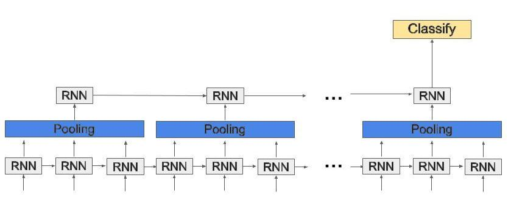
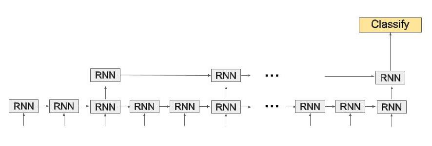

# Temporal Pooling for Video Classification
This is experimental code for temporal pooling networks for video classification on
the [Youtube 8M dataset](https://research.google.com/youtube8m/). The code follows the format of the [starter code](https://github.com/google/youtube-8m) given
by Youtube for this dataset. I have added my temporal pooling network model code in
the frame level models file.

## Temporal Pooling Networks
The concept of temporal pooling networks is rather simple, instead of stacking RNN
layers on top of one another, pool their outputs between each layer. This has several
affects; it reduces the time length with which the RNN needs to process, thus reducing
compuration time, and it aggregates temporal information which is critical for video
summarization and classification tasks. Below are two diagrams describing two network
structures, one where a pooling operation is inserted between layers, and one where
outputs are skipped between layers.





## Overview of Models
TODO: Add paper reference when completed
*   `TemporalPoolingNetworkModel`: Processes the features of each frame using a GRU neural net. The
                outputs of the GRU are then locally pooled and fed into the second GRU layer. The 
                internal state of the GRU's are then fed into a video-level model for classification.
*   `TemporalSkippingNetworkModel`: Processes the features of each frame using a GRU neural net. The
                outputs of the GRU are then skipped with input stride and fed into the second GRU layer. The 
                internal state of the GRU's are then fed into a video-level model for classification.

## Example Usage
Below is an example of how to run a temporal pooling network model with average pooling, kernel width of 3,
and stride of 3:
```
python train.py --train_data_pattern='/home/mwoodson/data/train/train*.tfrecord' \
--frame_features=True --model=TemporalPoolingNetworkModel \
--feature_names="rgb, audio" --feature_sizes="1024, 128" \
--lstm_cells=1024 --pool_size=3 --pool_stride=3 --pool_type=AVG \
--learned_pooling=False --train_dir=$MODEL_DIR/test_pool \
--base_learning_rate=0.001 --batch_size=128 --num_epochs=5 \
--start_new_model=True
```

And the same example but using temporal skipping instead of pooling:
```
python train.py --train_data_pattern='/home/mwoodson/data/train/train*.tfrecord' \
--frame_features=True --model=TemporalSkippingNetworkModel \
--feature_names="rgb, audio" --feature_sizes="1024, 128" \
--lstm_cells=1024 --pool_size=3 --pool_stride=3 --pool_type=AVG \
--learned_pooling=False --train_dir=$MODEL_DIR/test_pool \
--base_learning_rate=0.001 --batch_size=128 --num_epochs=5 \
--start_new_model=True
```

## Results